# Introduction

There is a multitude of possible options to host a website in Azure. The right way to host your website depends on the technology you use to create your website content.

For static website content, one of the cheapest ways to host in Azure is to use a static website enabled storage account.

## Warning

If you follow along with the instructions in this Article, this will generate costs on your Azure subscription.

# Requirements

* Azure Account with the appropriate rights to add resource groups, storage accounts and CDN endpoints
* Active Azure subscription
* (optional) official registered domain name if you want to access your website with your own domain.

# Step by Step Instructions

* [Introduction](#introduction)
    * [Warning](#warning)
* [Requirements](#requirements)
* [Step by Step](#step-by-step)
    * [Create a new Resource Group](#create-a-new-resource-group)
    * [Add a new storage account to your resource group](#add-a-new-storage-account-to-your-resource-group)
    * [Enable Static Website on your storage account](#enable-static-website-on-your-storage-account)
    * [Create new CDN Profile and add an Endpoint](#create-new-cdn-profile-and-add-an-endpoint)
    * [(optional) Addd a Custom Domain Name](#optional-addd-a-custom-domain-name)
    * [(optional) Configure HTTPS on custom domain](#optional-configure-https-on-custom-domain)
    * [Create a index.html and upload it](#create-a-indexhtml-and-upload-it)

## Create a new Resource Group

1\. Login to [https://portal.azure.com](https://portal.azure.com) and go to Resource Groups

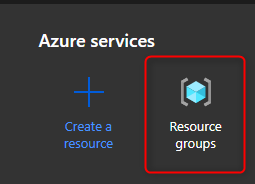

2\. Click Add

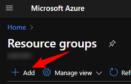

3\. Enter a name for your resource group\, choose your appropriate region and subscription and click "Review \+ create"

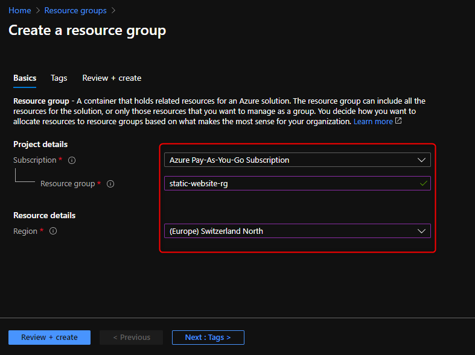

4\. After successful validation\, click "Create"

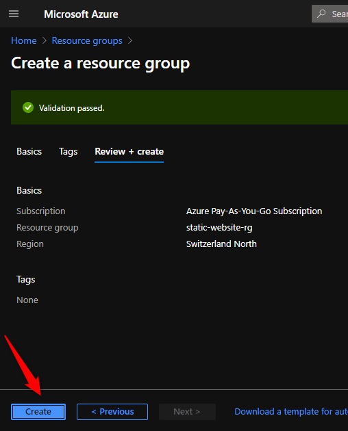

- - -

## Add a new storage account to your resource group

1\. Go to your previously created resource group and click "Add"
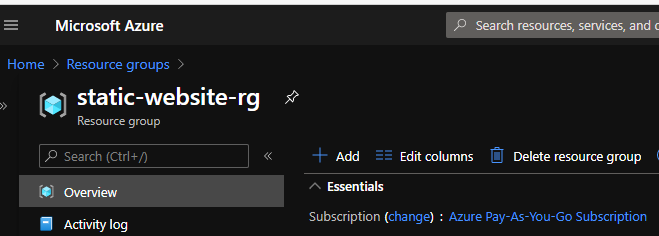

2\. Search for Storage account and click "create"

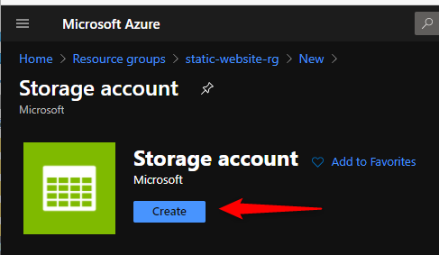

3\. Choose a uniqe name for the storage acocunt\, choose your appropriate region and click "Review \+ create"

> Note: You can customize a multitude of options for your storage account depending on your needs. For this tutorial we will work with standard settings.

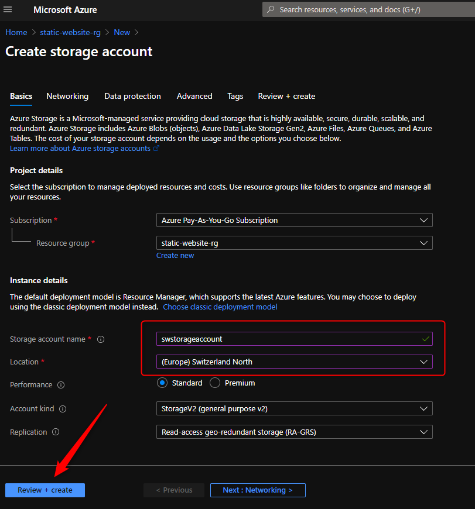

4\. After successfull validation\, click "Create"

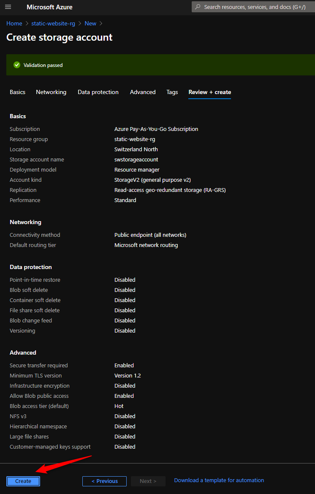

- - -

## Enable Static Website on your storage account

1\. Goto your previously created storage account and click Static Website under Settings

2\. Toggle the Static website button to Enabled

3\. Enter a document names for your index and error document\.

> Note: This is needed for the most basic routing scenarios. If your static website needs more sophisticated routing scenarios, you need to create special routing rules in the Rule Engine which is provided only in Premium\_Verizon CDN tier. We will get back to this in another post of the series.

4\. Click Save

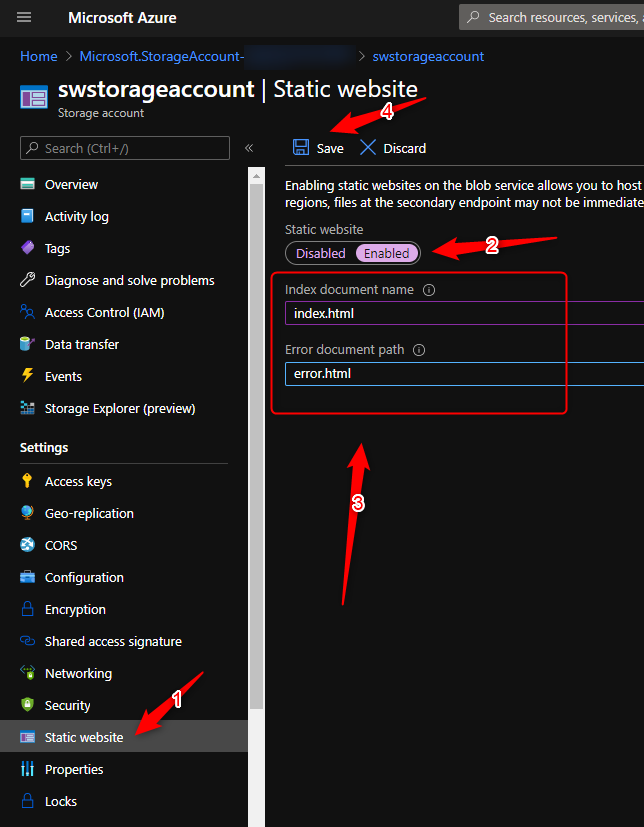

This will add 2 endpoint urls wich we will need when we will add a custom domain later on

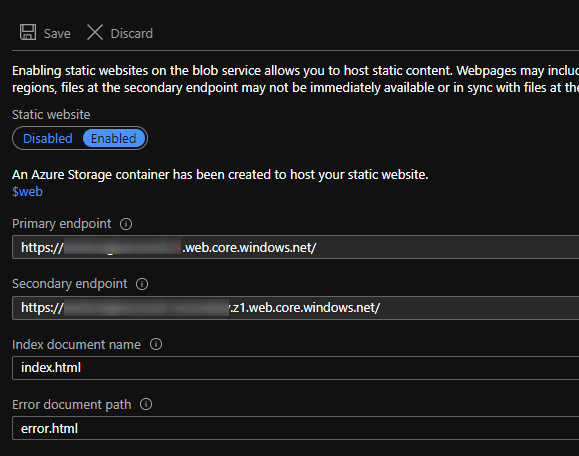

- - -

## Create new CDN Profile and add an Endpoint

Next up we will create a CDN profile and add an endpoint to it. Purpose of this is to add our content to a content delivery network which will make sure our content can be delivered as fast as possible, depending on the location where the site is accessed from.

1\. Go to your previously created storage account and click Azure CDN under Blob Service

2\. Select "Create new" and enter a profile and an endpoint name

3\. Select your desired pricing tier

> Note! You can choose from the following tiers:
> 
> 
> * Standard Microsoft
> * Standard Verizon
> * Standard Akamai
> * Premium Verizon
> 
> 
> For this tutorial we will use the "Standard Microsoft" tier but if you have special routing needs as aformentioned, you need to use "Premium Verizon" which is the most expensive tier.

4\. Change Origin Hostname to the one marked as \(Static website\)

5\. Click create

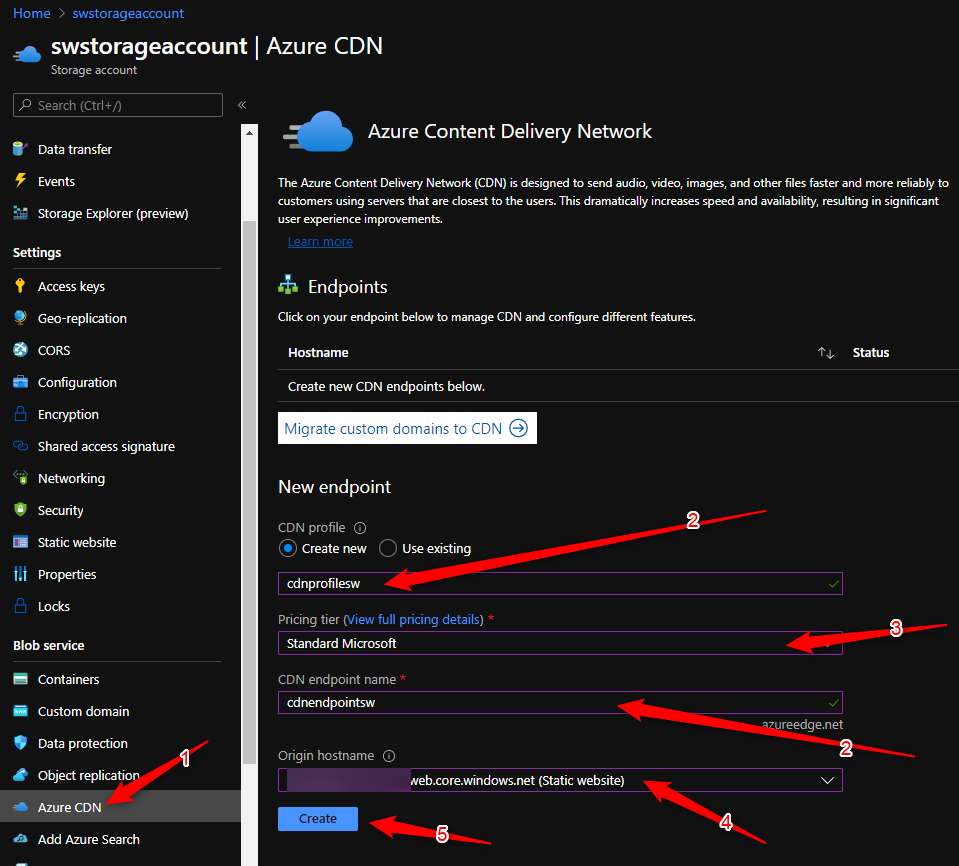

- - -

## (optional) Addd a Custom Domain Name

1\. Go to your newly created Endpoint and write down your Endpoint hostname

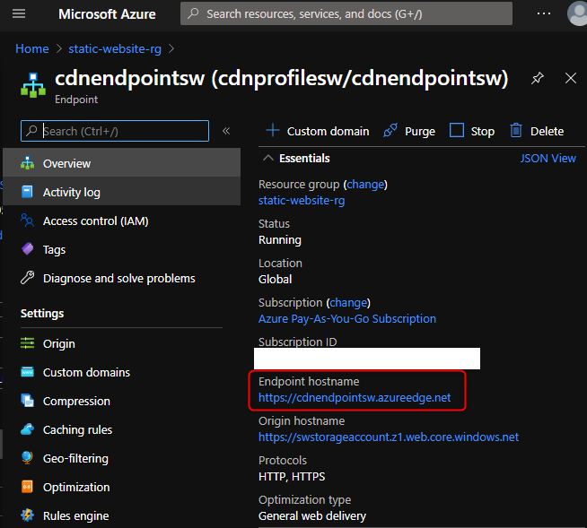

2\. In the DNS tool of your choosing\, create a CNAME record for your custom domain name to your CDN Endpoint Hostname like in the example below and make sure it resolves properly

```
blog.woernd.li    IN    CNAME    cdnendpointsw.azureedge.net
```

3\. Click on "Custom Domain"

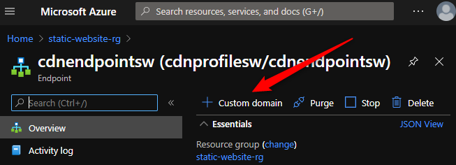

4\. Enter your custom domain and click "Add"

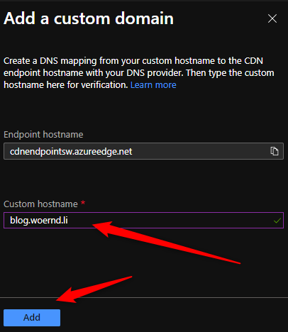

- - -

## (optional) Configure HTTPS on custom domain

1\. Go to CDN Endpoint and click on your newly created custom domain

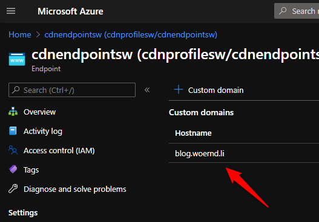

2\. Toggle "Custom domain HTTPS" to On and click save

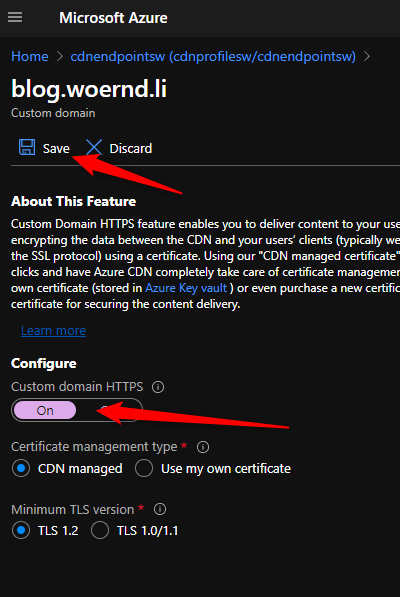

Enabling HTTPS will take a while.

- - -

## Create a index.html and upload it

First create an index.html file with the follwoing content

```
<h1>Hello World!</h1>
```

1\. Go to your storage account and click on "Containers" under "Blob service"

2\. Open the $web container

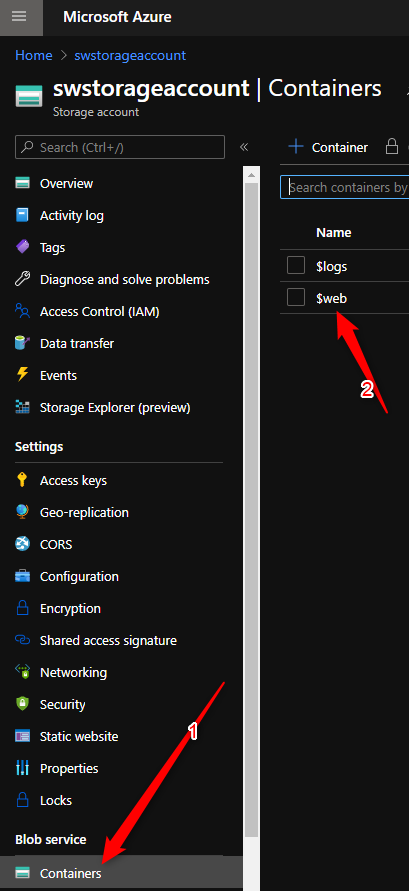

3\. Click the "Upload" button

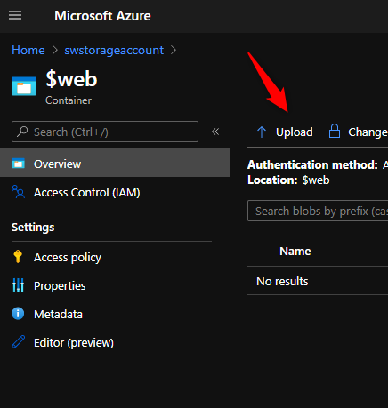

4\. Select your index\.html and click the "Upload" button

- - -

Your Static Website is now configured and you can access it by either using your custom domain name or the CDN Endpoint Name.

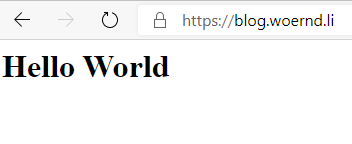