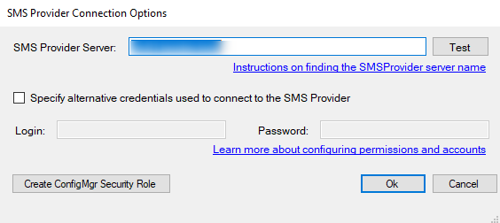
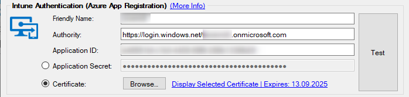
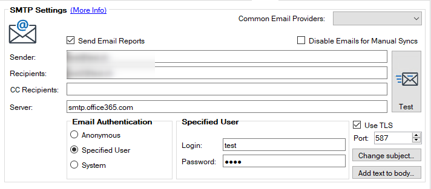
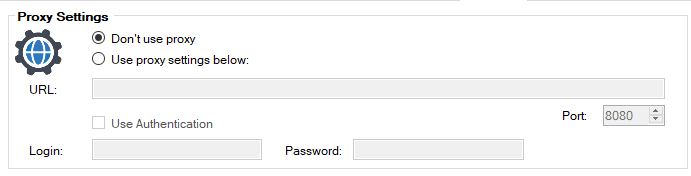

# Introduction

A few days ago [@LuemmelSec](https://twitter.com/theluemmel) published [PMP-Decrypter](https://github.com/LuemmelSec/PMP-Decrypter) to decrypt the secrets in the locally stored settings.xml of PatchMyPCs Publisher Service using registry information that is available to all users with access to the system.

While this is certainly a design flaw, let's look at what is actually impacted by it and in which scenario.

## Impacted Secrets

|Secret  |Scenario  |
|---------|---------|
|**SMS Provider Credentials** |PatchMyPC Publisher Service is connecting to Configuration Manager SMS Provider with a dedicated Service Account |
|**Intune Authentication**|PatchMyPC Publisher Service is authentication to Intune using a Client Secret|
|**SMTP Authentication**|SMTP Authentication when using a specified user|
|**Proxy Authentication**|When using a proxy and dedicated credentials to authanticate to the proxy|

 

### SMS Provider Credentials

PatchMyPC creates a new Security Role in ConfigMgr with the following permissions:

- Application: Read, Modify, Delete, Set Security Scope, Create, Move Object, Modify Folder
- Distribution Point: Read, Copy to Distribution Point
- Distribution Point Group: Read, Copy to Distribution Point Group
- Folder Class: Read, Modify, Create
- Security Scopes: Read
- Site: Read
- Software Updates: Read, Modify

If configured correctly, the service account provided is limited to above permissions and the impact is rather limited.

By default, however, PatchMyPC publisher connects to the SMS provider using the local system account, which leaves no secret stored in settings.xml

### Intune Authentication

Using a client secret for authenticating to Intune through the dedicated Enterprise Application, is the easiest way to setup the connection.

Following PatchMyPC's setup documentation this will also be limited to the following actions:

- DeviceManagementApps.ReadWrite.All (View and create applications in Intune)
- DeviceManagementConfiguration.Read.All (View properties and relationships of assignment filters)
- DeviceManagementManagedDevices.Read.All (View device inventory for the auto-publish feature)
- DeviceManagementRBAC.Read.All (View scopes to be assigned to applications)
- DeviceManagementServiceConfig.ReadWrite.All (Update Enrollment Status Page configurations)

A better way to setup the connection and getting rid of a usable Cllient Secret in the process, is using a certificate for authenticating the PatchMyPC Publisher Service to Intune.

Please find detailed instructions to setup certification in PatchMyPC's setup instructions.

[PatchMyPC Intune Certificate Authentication](https://docs.patchmypc.com/installation-guides/intune/azure-app-registration#option-1-creating-a-self-signed-certificate)

### SMTP Authentication

When using a user account to authenticate against SMTP services, the gathered credentials could be used for phishing attacks or spreading malware.

Depending on the SMTP service used, you should authenticate the system or use a way to send anonymously, which leaves no secret to decrypt in settings.xml.

Microsoft provides some guidance, how to configure your services and devices to authenticate against Exchange Online services for using SMTP in such scenarios in the following documentation.

[Send mail directory from your application to Microsoft 365 (direct send)](https://learn.microsoft.com/exchange/mail-flow-best-practices/how-to-set-up-a-multifunction-device-or-application-to-send-email-using-microsoft-365-or-office-365#option-2-send-mail-directly-from-your-printer-or-application-to-microsoft-365-or-office-365-direct-send)

### Proxy Authentication

In moste enterprises, On-Premise systems like Configuration Manager connect through a Proxy to then Internet.

When using dedicated service accounts to connect through the proxy, an attacker might use the gathered credentials to connect to various internet endpoints they might would not be able to otherwise.

Depending on the proxy infrastructure used, the dedicated service account should only be able to connect from a specific system or the authentication to the proxy should be based on the system itself directly.

## Summary

While the reported issue is certainly a design flaw, the impact on a properly configured and secured PatchMyPC environment is rather limited.
The above information might help you to adjust your environment if credentials are used.